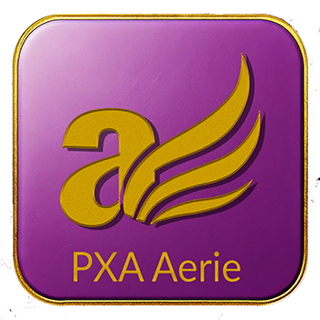

# aerie.Showcase

  

> A curated architecture showcase for Aerie — Phoenix Ascend’s modular developer framework.

This repository provides a public demonstration of **Aerie**, a modular architecture system developed by Phoenix Ascend. Aerie is a developer toolkit crafted for teams who believe software should be intentional, not accidental. It includes a subset of reusable components, utility types, and example Plumes to highlight the intentionality, modularity, and naming principles that guide our software design.

---
## Design Principles

Aerie prioritizes structure, clarity, and extensibility over shortcuts or assumptions.  
All public behaviors are designed to be testable, modular, and intentional.

### 🔑 Key Normalization Behavior

Lexicon keys are normalized to uppercase using `ToUpperInvariant()` during construction.

This means:
- All key lookups are **case-insensitive**
- Keys like `"email"`, `"EMAIL"`, and `"Email"` are treated as the **same**
- If multiple casing variants are provided, **the last one wins**

This behavior is **intentional**.  
It reflects Aerie’s design principle of predictable structure and consistent lookup — regardless of how input data is sourced or formatted.

---

## 🧩 What’s Included

- **PXA.Aerie.Lexicon** — centralized vocabulary for enum-like constants, exception messages, and regular expressions accessed through the static `LexiconProvider` using swappable, interface-based lexicon modules  
- **PXA.Aerie.Core** — foundational types like `MethodResult<T>`, `IDataRow`, and utility interfaces  
- **PXA.Aerie.LogPlume** — a sample Plume for structured logging and correlation  
- **Unit Tests** — lightweight tests that show integration style and expectations  

---

## 🚫 What’s Not Included

This is a showcase only. Full Aerie internals such as:  
- `PXA.Aerie.Nest` (request flow patterns)  
- `PXA.Aerie.Perch` (app bootstrap logic)  
- Proprietary Phoenix Ascend application logic  
...are **intentionally excluded**.

---

## 🎯 Purpose

Aerie isn’t just a framework. It’s a **toolkit for crafting software that matters**.

This showcase offers a transparent look into how Phoenix Ascend approaches architecture — through patterns that are elevated, names that mean something, and components that stay out of your way.

Whether you’re evaluating Phoenix Ascend for a project or just exploring new ways to structure software: this is your window in.

---

<h2>
  
  About phoenix ascend
</h2>

Aerie is developed and maintained by [phoenix ascend](https://www.phoenixascend.com), a software consultancy focused on clean architecture, developer clarity, and meaningful modular systems.

**Crafting Software that Matters.**

For branding, consulting, or collaboration inquiries, visit us at [phoenixascend.com](https://www.phoenixascend.com).
